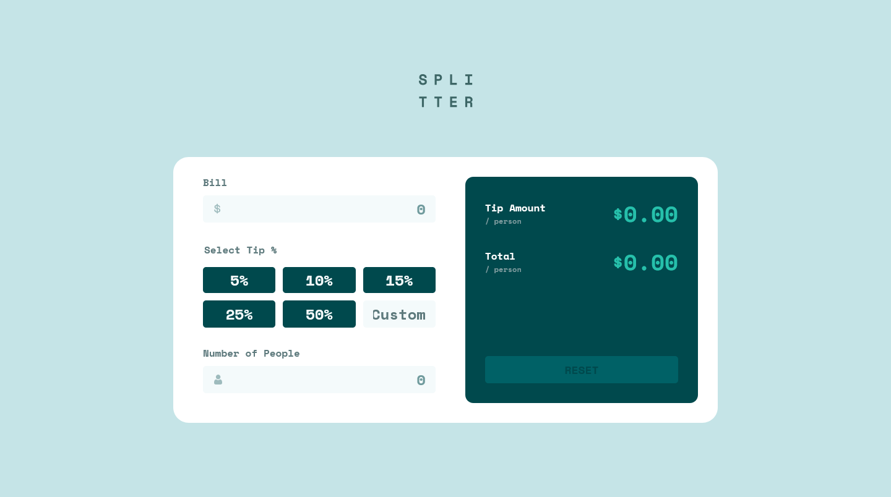

# Frontend Mentor - Tip calculator app solution

This is a solution to the [Tip calculator app challenge on Frontend Mentor](https://www.frontendmentor.io/challenges/tip-calculator-app-ugJNGbJUX). Frontend Mentor challenges help you improve your coding skills by building realistic projects.

## Table of contents

- [Overview](#overview)
  - [The challenge](#the-challenge)
  - [Screenshot](#screenshot)
  - [Links](#links)
- [My process](#my-process)
  - [Built with](#built-with)
  - [What I learned](#what-i-learned)
  - [Continued development](#continued-development)
  - [Useful resources](#useful-resources)
- [Author](#author)
- [Acknowledgments](#acknowledgments)

**Note: Delete this note and update the table of contents based on what sections you keep.**

## Overview

### The challenge

Users should be able to:

- View the optimal layout for the app depending on their device's screen size
- See hover states for all interactive elements on the page
- Calculate the correct tip and total cost of the bill per person

### Screenshot



### Links

- Solution URL: [Add solution URL here](https://github.com/PastaSus/tip-calculator-app-main)
- Live Site URL: [Add live site URL here](https://pastasus.github.io/tip-calculator-app-main/)

## My process

### Built with

- Semantic HTML5 markup
- CSS custom properties
- Flexbox
- CSS Grid
- Mobile-first workflow
- Accessibility(ARIA attributes)
- [Constraint Validation API](https://developer.mozilla.org/en-US/docs/Learn_web_development/Extensions/Forms/Form_validation) - Form Validations
- [Javascript](https://developer.mozilla.org/en-US/docs/Learn_web_development/Core/Scripting) - Vanilla Javascript
- [Styled Components](https://styled-components.com/) - For styles

### What I learned

This app is a Tip Calculator that uses modern JavaScript best practices such as event delegation, constraint validation API, and separation of concerns. Below is a step-by-step breakdown of the main logic and features implemented:

✅ Step 1: Form Validation using Constraint Validation API

Used input.validity to check for:

Empty fields (valueMissing)

Invalid values (rangeUnderflow)

Displayed custom error messages for bill and people inputs.

Highlighted invalid inputs with error messages and visual cues.

✅ Step 2: Input Validation on Typing

Added a single input event listener on the form (using event delegation).

Validated fields in real-time and toggled the Reset button depending on input presence.

✅ Step 3: Tip Calculation via Button Clicks

Used event delegation to handle clicks on tip percentage buttons.

Retrieved the data-tip value from the clicked element.

Used a reusable calculateTip function to compute and display:

Tip per person

Total per person

✅ Step 4: Custom Tip Input

Listened for input events on the custom tip field.

Dynamically calculated tip and total using the same reusable function.

✅ Step 5: Reset Functionality

Created a resetCalculator() function to:

Clear all inputs and outputs

Remove errors and reset styles

Disable the reset button

Attached this function to the Reset button's click event.

✨ Other Best Practices

Modularized functions for clarity and reusability

Centralized DOM selections

Used clean event handling

Organized code based on logical steps

To see how you can add code snippets, see below:

```js
tipOptions.addEventListener("click", (e) => {
  const clicked = e.target;

  if (clicked.matches("[data-tip]")) {
    const tipPercent = parseFloat(clicked.dataset.tip);
    calculateTip(tipPercent);
  }
});
```

If you want more help with writing markdown, we'd recommend checking out [The Markdown Guide](https://www.markdownguide.org/) to learn more.

### Continued development

In future projects, I'd like to:

Add animations and transitions to improve UX

Save user input to localStorage so it's not lost on refresh

Improve accessibility (ARIA labels, keyboard navigation)

### Useful resources

- [Example resource 1](https://developer.mozilla.org/en-US/docs/Learn_web_development/Extensions/Forms/Form_validation#validating_forms_using_javascript) - Great resource for learning form validations.

- [Example resource 2](https://developer.mozilla.org/en-US/docs/Learn_web_development/Core/Scripting/Events) - This one is for event listeners

## Author

- Frontend Mentor - [@yourusername](https://www.frontendmentor.io/profile/PastaSus)
